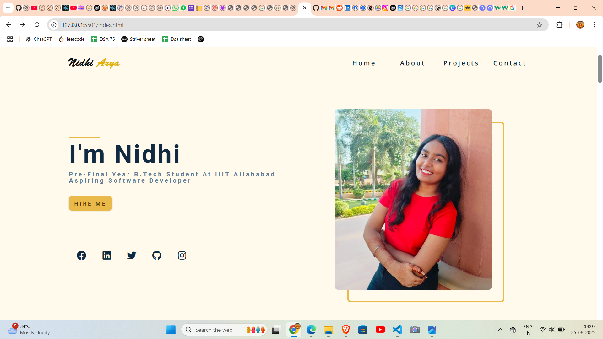

# 💼 My Portfolio Website

A modern and responsive personal portfolio website built using **HTML** and **CSS Grid**.

## 🚀 Features

- Fully responsive design
- Clean and professional layout
- Built with semantic HTML and CSS Grid
- Sections include:
  - Hero / Introduction
  - About Me
  - Skills
  - Projects
  - Contact

## 🛠️ Technologies Used

- HTML5
- CSS3
- CSS Grid
- Google Fonts (optional)
- Media Queries (for responsiveness)

## 📸 Preview

  

## 📂 Project Structure

